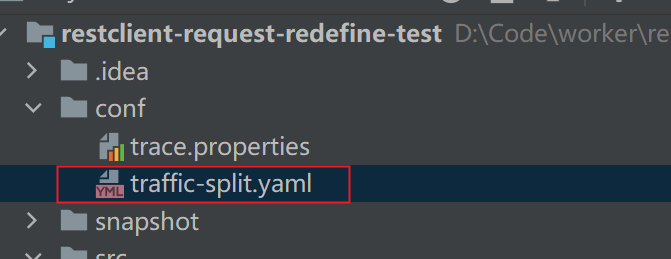

## Step 1: 添加依赖

```xml
<dependency>
    <groupId>io.esastack</groupId>
    <artifactId>traffic-split-file-config</artifactId>
    <version>${esa-restclient.version}</version>
</dependency>
```

## Step 2: 配置
如下图所示，在项目根路径的conf目录下新建名为`request-redefine.yaml`的配置文件:


### 配置Demo
```yaml
# 可以不配置，默认为false，为true时，自动关闭分流功能
close: 'false'
# 规则，数据结构为数组，用户可同时配置多条，当请求命中一条时，后续的规则将不再匹配
rules:
  # 规则名称
  - name: "aaa"
    # 多条conditions的match模式，all指所有condition匹配时才算匹配
    match: 'all'   
    # 规则的匹配条件，数据结构为数组，用户可设置多个condition
    conditions:
      # 第一条 condition
      - method: 'post'
        uriAuthority:
          exact: "localhost:8080"
        header:
          - name: 'name1'
            value: 
              exact: 'value1'
      # 第二条 condition
      - params:
          - name: 'name3'
            value:
              exact: 'value3'
    # 当 conditions 匹配上时，要执行的动作
    action:
      rewrite:
        uriAuthority: "localhost:8080"
        path: "/request/redefineSuccess"
      headers:
        add:
          a: "xxx"
          b: "aaa"
```
### 配置说明
#### 主要配置项

|   配置项   |     数据结构     |                           配置内容                           |
  | :--------: | :--------------: | :----------------------------------------------------------: |
|    name    |      String      |                           规则名称                           |
|   match    |      String      | all : 所有condition匹配时才算匹配<br>any : 任意一个condition匹配时就算匹配<br>not : 所有condition都要不匹配时才算匹配 |
| conditions | List\<Condition> |           规则的匹配条件，用户可设置多个condition            |
|   action   |  List\<Action>   |              当 conditions 匹配时，要执行的动作              |

### Condition

|    配置项    |           数据结构           |                           配置内容                           |
| :----------: | :--------------------------: | :----------------------------------------------------------: |
|    method    |            String            |          要匹配的方法: Get、Post 等等，不区分大小写          |
| uriAuthority |            String            |                    要匹配的 uriAuthority                     |
|     path     |            String            |                        要匹配的 path                         |
|   headers    | Map\<String , StringMatcher> | 要匹配的 header，key为header的name，value为StringMatcher(见下文介绍)，StringMatcher为空时，则代表匹配任意value |
|    params    | Map\<String , StringMatcher> | 要匹配的 param，key为header的name，value为StringMatcher(见下文介绍)，StringMatcher为空时，则代表匹配任意value |

#### `StringMatcher`

| 配置项 | 数据结构 |    配置内容    |
| :----: | :------: | :------------: |
| exact  |  String  | 精确匹配的内容 |
| prefix |  String  | 前缀匹配的内容 |
| regex  |  String  | 正则匹配的内容 |

### Action

| 配置项  |                      配置说明                      |
| :-----: | :------------------------------------------------: |
| rewrite | 重写请求的 uriAuthority 或者 path (具体配置见下文) |
| headers |         操作请求的 headers(具体配置见下文)         |
| params  |         操作请求的 params(具体配置见下文)          |

#### `rewrite`

|    配置项    | 数据结构 |       配置内容       |
| :----------: | :------: | :------------------: |
| uriAuthority |  String  | 重写后的uriAuthority |
|     path     |  String  |     重写后的path     |

#### `headers`

| 配置项 |       数据结构        |     配置内容     |
| :----: | :-------------------: | :--------------: |
|  set   | Map\<String , String> |  要设置 headers  |
|  add   | Map\<String , String> |  要新增 headers  |
| remove |    List\<String >     | 要删除的 headers |

#### `params`

| 配置项 |       数据结构        |    配置内容     |
| :----: | :-------------------: | :-------------: |
|  set   | Map\<String , String> |  要设置 params  |
|  add   | Map\<String , String> |  要新增 params  |
| remove |    List\<String >     | 要删除的 params |